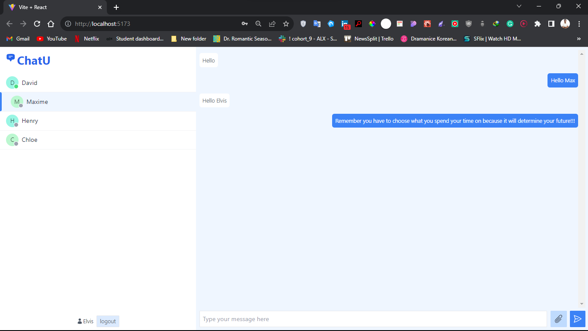

# ChatU

## Project Description

The ChatU project aims to develop a real-time chat application that allows users to communicate with each other seamlessly and interactively. The project addresses the growing need for efficient communication tools in the digital age.

### Learning Objectives

- Enhance my proficiency in full-stack web development back-end (Node js) and front-end (React js).
- Learn how to integrate real-time features using WebSockets in Node js.
- Improve my skills in user authentication and authorization.
- Gain experience in designing and developing a modern user interface with React.

### Technologies Used

#### Front-end (React):

- Design a user-friendly interface for chat rooms and messages.
- Create React components for different app elements.
- Manage application state using libraries like Redux or React Context.
- Implement real-time communication with WebSockets.
- Connect to the Node.js back-end API for data exchange.
- Secure user authentication and authorization.
- Utilize React Router for navigation.

#### Back-end (Node.js with Express.js):

- Design RESTful or GraphQL APIs for chat functionality.
- Set up a WebSocket server for real-time messaging.
- Choose and configure a database system which is MongoDB.
- Develop user authentication and implement security measures.
- Manage user roles and permissions.
- Implement error handling and logging for system stability.
- Write tests for API endpoints and ensure reliability.

### Video Description of the project

https://github.com/Elvis-Guy/ChatU/assets/104826115/6b1443e2-c7f3-4b9b-8eb6-bd4265219e4e

### Author

[guyelvisbakunzi@gmail.com](mailto:guyelvisbakunzi@gmail.com)
